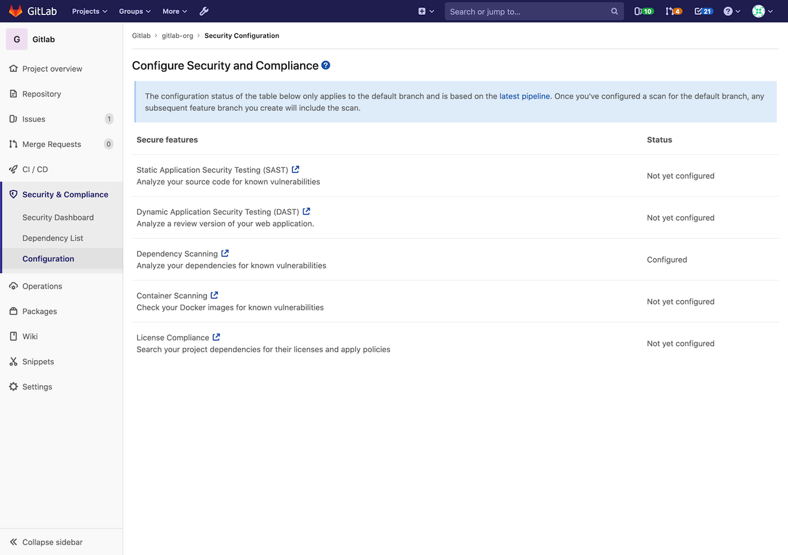
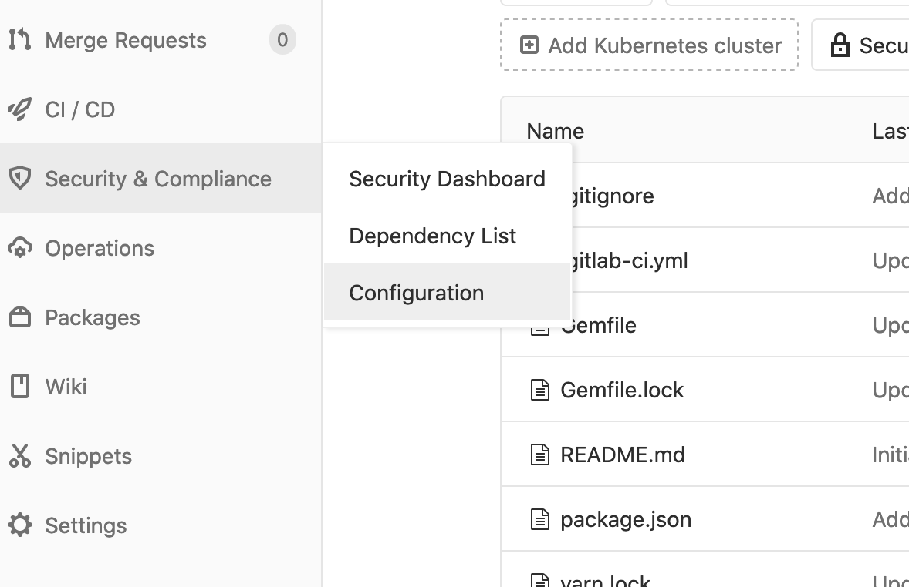
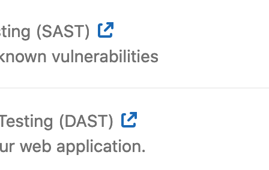

# Security Configuration **(ULTIMATE)**

> [Introduced](https://gitlab.com/gitlab-org/gitlab/merge_requests/20711)
in [GitLab Ultimate](https://about.gitlab.com/pricing/) 12.6.

## Overview

The security configuration page displays the configuration state
of each of the security features.

It can be accessed through a project's sidebar nav.

The page uses the project's latest default branch [CI pipeline](../../../ci/pipelines) to
determine the configuration state of each feature. If a job with the
expected security report artifact exists in the pipeline,
the feature is considered configured.

Note: if the latest pipeline used [Auto DevOps](../../../topics/autodevops/index),
all security features will be configured by default.

## Limitations

At the moment, it is not possible to enable or disable a feature using
the configuration page. However, instructions on how to enable or disable a
feature can be found through the links next to each feature on
that page.

